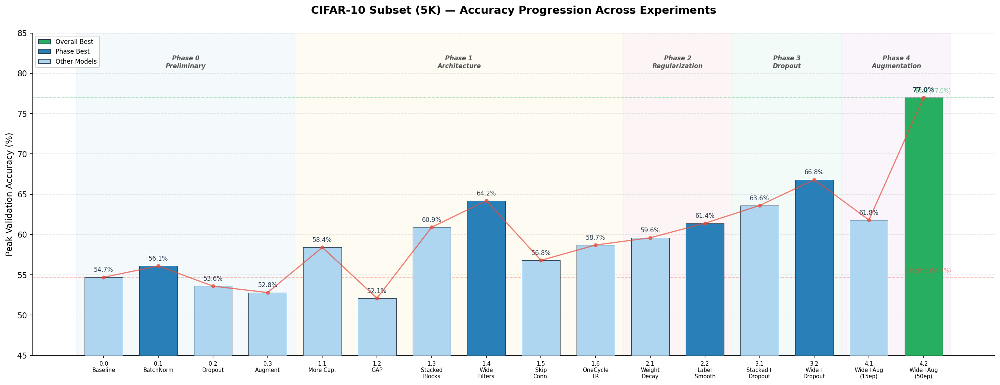

# CIFAR-10 Subset CNN Experiments

A hands-on task involving training and experimenting with a small CNN on a CIFAR-10 subset.  
Approach: **Architecture first → Regularization → Dropout → Augmentation**.

## Accuracy Progression



## Project Structure

```
├── notebooks/
│   ├── Phase 0 — Preliminary (simple 2-layer CNN)
│   │   ├── 0.0_baseline_simple_cnn.ipynb
│   │   ├── 0.1_simple_batchnorm.ipynb
│   │   ├── 0.2_simple_dropout.ipynb
│   │   └── 0.3_simple_augmentation.ipynb
│   ├── Phase 1 — Architecture exploration
│   │   ├── 1.1_increasing_model_capacity.ipynb
│   │   ├── 1.2_gap_replacing_dense_layers.ipynb
│   │   ├── 1.3_stacked_conv_blocks.ipynb
│   │   ├── 1.4_widening_information_bottleneck.ipynb
│   │   ├── 1.5_skip_connections.ipynb
│   │   └── 1.6_one_cycle_lr.ipynb
│   ├── Phase 2 — Regularization (on best architecture)
│   │   ├── 2.1_weight_decay.ipynb
│   │   └── 2.2_label_smoothing.ipynb
│   ├── Phase 3 — Dropout
│   │   ├── 3.1_stacked_blocks_dropout.ipynb
│   │   └── 3.2_wider_filters_dropout.ipynb
│   ├── Phase 4 — Data Augmentation
│   │   ├── 4.1_wider_filters_augmentation.ipynb
│   │   └── 4.2_augmentation_longer_training.ipynb
│   └── Phase 5 — Final Evaluation
│       └── 5.0_final_comparison.ipynb
├── data/                        # CIFAR-10 (auto-downloaded by torchvision, gitignored)
├── scripts/                     # Utility scripts for notebook refactoring
├── requirements.txt
└── README.md
```

> **Note:** The `data/` directory is created automatically by `torchvision.datasets.CIFAR10(download=True)` on
> first run. It is gitignored and does not need to be committed.

## Setup

```bash
# Create a virtual environment
python3 -m venv venv
source venv/bin/activate        # macOS / Linux
# .\venv\Scripts\activate       # Windows

# Install exact pinned dependencies
pip install -r requirements.txt
```

> All dependencies in `requirements.txt` are version-pinned for reproducibility.

## Dataset

| Property | Value |
|---|---|
| Dataset | CIFAR-10 |
| Training subset | 5,000 images (**stratified random split**, 500 per class) |
| Validation subset | 1,000 images (**stratified random split**, 100 per class) |
| Held-out test set | 9,000 images (remaining from CIFAR-10 test split, used only in `5.0`) |
| Image size | 32×32×3 |
| Classes | 10 (airplane, automobile, bird, cat, deer, dog, frog, horse, ship, truck) |
| Normalization | mean=(0.4914, 0.4822, 0.4465), std=(0.2470, 0.2435, 0.2616) |
| Random seed | `SEED = 42` — set for `torch`, `numpy`, `random`, and `torch.cuda` in every notebook |

## Baseline — Model 0 (SimpleCNN)

**Architecture:**
```
Conv2d(3→16, 3×3, pad=1) → ReLU → MaxPool(2)
Conv2d(16→32, 3×3, pad=1) → ReLU → MaxPool(2)
Flatten → Linear(2048→128) → ReLU → Linear(128→10)
```

**Training config:** Adam (lr=0.001) · CrossEntropyLoss · 15 epochs · batch size 64

## Model Comparison Table

### Phase 0 — Preliminary (Simple 2-Layer CNN)

| # | Model | Params | Peak Val Acc | Train–Val Gap | Diagnosis | Notebook |
|---|---|---|---|---|---|---|
| 0.0 | SimpleCNN (baseline) | 268,650 | 54.70% | +31.46% | Overfitting | [0.0_baseline_simple_cnn.ipynb](notebooks/0.0_baseline_simple_cnn.ipynb) |
| 0.1 | SimpleCNN + BatchNorm | 269,002 | 56.10% | +45.02% | Overfitting | [0.1_simple_batchnorm.ipynb](notebooks/0.1_simple_batchnorm.ipynb) |
| 0.2 | SimpleCNN + Dropout | 268,650 | 53.60% | +2.72% | Underfitting | [0.2_simple_dropout.ipynb](notebooks/0.2_simple_dropout.ipynb) |
| 0.3 | SimpleCNN + Augmentation | 268,650 | 52.80% | +1.84% | Underfitting | [0.3_simple_augmentation.ipynb](notebooks/0.3_simple_augmentation.ipynb) |

### Phase 1 — Architecture Exploration

| # | Model | Params | Peak Val Acc | Train–Val Gap | Diagnosis | Notebook |
|---|---|---|---|---|---|---|
| 1.1 | Increased Capacity (3-layer) | 620,362 | 58.40% | +34.96% | Overfitting | [1.1_increasing_model_capacity.ipynb](notebooks/1.1_increasing_model_capacity.ipynb) |
| 1.2 | GAP (Global Avg Pool) | 94,538 | 52.10% | +1.94% | Underfitting | [1.2_gap_replacing_dense_layers.ipynb](notebooks/1.2_gap_replacing_dense_layers.ipynb) |
| 1.3 | Stacked Conv Blocks + BN + GAP | 289,194 | 60.90% | +34.64% | Overfitting | [1.3_stacked_conv_blocks.ipynb](notebooks/1.3_stacked_conv_blocks.ipynb) |
| 1.4 | Wide Filters (64→128→256) + BN + GAP | 1,149,770 | **64.20%** | +26.84% | Overfitting | [1.4_widening_information_bottleneck.ipynb](notebooks/1.4_widening_information_bottleneck.ipynb) |
| 1.5 | Skip Connections (ResBlocks) | 1,190,922 | 56.80% | +41.38% | Overfitting — [see analysis](notebooks/1.5_skip_connections.ipynb) | [1.5_skip_connections.ipynb](notebooks/1.5_skip_connections.ipynb) |
| 1.6 | One Cycle LR (on 1.5 arch) | 1,190,922 | 58.70% | +40.72% | Overfitting | [1.6_one_cycle_lr.ipynb](notebooks/1.6_one_cycle_lr.ipynb) |

### Phase 2 — Regularization (on best architecture from Phase 1)

| # | Model | Params | Peak Val Acc | Train–Val Gap | Diagnosis | Notebook |
|---|---|---|---|---|---|---|
| 2.1 | Stacked Blocks + Weight Decay (L2) | 289,194 | 59.60% | +34.76% | Severe overfitting | [2.1_weight_decay.ipynb](notebooks/2.1_weight_decay.ipynb) |
| 2.2 | Stacked Blocks + Label Smoothing | 289,194 | 61.40% | +43.70% | Still overfitting | [2.2_label_smoothing.ipynb](notebooks/2.2_label_smoothing.ipynb) |

### Phase 3 — Dropout

| # | Model | Params | Peak Val Acc | Train–Val Gap | Diagnosis | Notebook |
|---|---|---|---|---|---|---|
| 3.1 | Stacked Blocks + Dropout | 289,194 | 63.60% | −0.50% | Well-regularized | [3.1_stacked_blocks_dropout.ipynb](notebooks/3.1_stacked_blocks_dropout.ipynb) |
| 3.2 | Wider Filters + Dropout | 1,149,770 | **66.80%** | +3.24% | Mild overfitting | [3.2_wider_filters_dropout.ipynb](notebooks/3.2_wider_filters_dropout.ipynb) |

### Phase 4 — Data Augmentation

| # | Model | Params | Peak Val Acc | Train–Val Gap | Diagnosis | Notebook |
|---|---|---|---|---|---|---|
| 4.1 | Wider + Dropout + Augmentation (15 ep) | 1,149,770 | 61.80% | −3.74% | Good generalization | [4.1_wider_filters_augmentation.ipynb](notebooks/4.1_wider_filters_augmentation.ipynb) |
| 4.2 | Wider + Dropout + Aug + OneCycleLR (50 ep) | 1,149,770 | **77.00%** | +7.70% | Healthy | [4.2_augmentation_longer_training.ipynb](notebooks/4.2_augmentation_longer_training.ipynb) |

### Phase 5 — Final Test-Set Evaluation

| Metric | Value |
|---|---|
| Model | 4.2 — Wider Filters + Dropout + Augmentation + OneCycleLR |
| Best Validation Accuracy | 79.60% |
| **Held-out Test Accuracy** | **79.30%** |
| Val–Test Gap | +0.30% |
| Test samples | 9,000 (never seen during training or model selection) |

> See [5.0_final_comparison.ipynb](notebooks/5.0_final_comparison.ipynb) for the confusion matrix and per-class F1 scores.

## Conclusion

**Best model: 4.2 — Wider Filters + Dropout + Augmentation + OneCycleLR (50 epochs) → 77.00% val accuracy, 79.30% held-out test accuracy.**

Starting from a simple 2-layer CNN at 54.70%, systematic experimentation across five phases revealed several key insights for training on a small (5K sample) CIFAR-10 subset:

1. **Architecture matters most.** Stacked conv blocks with BatchNorm and GAP (Model 1.3) jumped to 60.90%, and widening filters to 64→128→256 (Model 1.4) pushed it to 64.20% — the two biggest accuracy gains in the entire study. Skip connections (1.5) did not help on this small dataset ([detailed analysis here](notebooks/1.5_skip_connections.ipynb)).

2. **Traditional regularization alone is insufficient.** Weight decay (2.1) and label smoothing (2.2) achieved 59.60% and 61.40% respectively, with large train–val gaps. On a data-starved regime, penalizing weights or softening labels cannot compensate for the lack of data diversity.

3. **Dropout is the single most effective regularizer.** Adding dropout to the stacked blocks (3.1) collapsed the train–val gap from +34.64% to **−0.50%** while maintaining 63.60% accuracy — the best-regularized model before augmentation.

4. **Data augmentation + longer training unlocks the best performance.** Augmentation with only 15 epochs (4.1) wasn't enough for convergence (61.80%). Extending to 50 epochs with OneCycleLR (4.2) achieved **77.00%** — a **+22.30 pp** improvement over the baseline and **+12.80 pp** over the best architecture-only model.

5. **Order of operations matters.** The progression *architecture → regularization → dropout → augmentation → training schedule* proved effective. Each phase built on the previous one's gains rather than trying to fix fundamental capacity or generalization issues with the wrong tool.

6. **Held-out test set confirms generalization.** The final model achieved **79.30%** on 9,000 held-out test samples (Val–Test gap of only +0.30%), confirming the model generalizes well beyond the validation set used during development.
